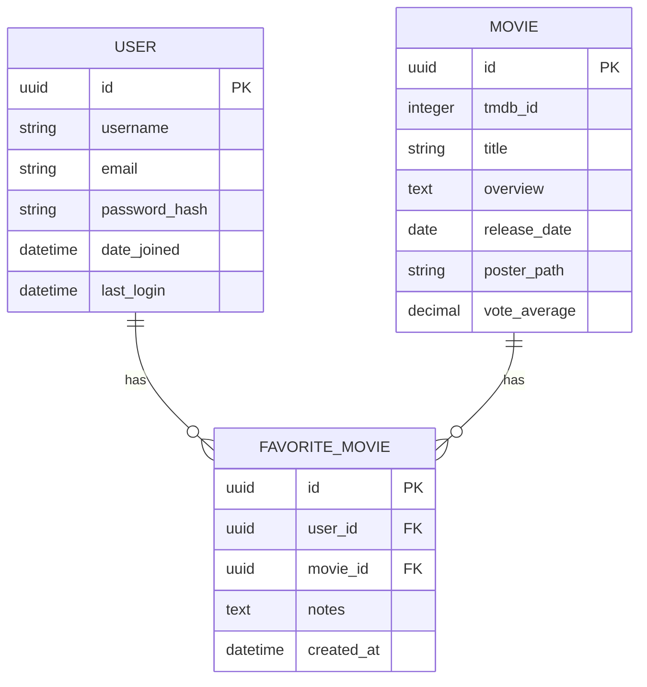

# Project Nexus - Movie Recommendation API

## 📋 Project Overview
A high-performance Django REST API for discovering and managing movie favorites with TMDb integration, built with scalability and best practices in mind.

## 🚀 Project Links


### . Presentation Deck
[🔗 View Presentation on Google Slides](https://docs.google.com/presentation)


### . Hosted API
🌐 [Production API](https://alx-project-nexus-production-8d4c.up.railway.app/)  
🔑 


## 🛠 Technical Implementation

### Database Schema


### Key Features
- **Authentication**: JWT-based secure authentication
- **Movie Discovery**: Browse trending, popular, and search movies
- **Favorites System**: Save and manage favorite movies
- **Caching**: Redis-based caching for improved performance
- **Documentation**: Comprehensive API documentation

### API Endpoints
| Method | Endpoint | Description | Auth Required |
|--------|----------|-------------|---------------|
| POST   | /api/v1/auth/register | Register new user | No |
| POST   | /api/v1/auth/login | User login | No |
| GET    | /api/v1/movies/trending | Get trending movies | No |
| GET    | /api/v1/movies/search | Search movies | No |
| POST   | /api/v1/movies/{id}/favorite | Add to favorites | Yes |
| GET    | /api/v1/favorites | List user favorites | Yes |

## 🚀 Deployment
- **Platform**: Railway
- **Database**: PostgreSQL
- **Cache**: Redis
- **CI/CD**: GitHub Actions

## 🧪 Testing
```bash
# Run tests
pytest

# Test coverage
coverage run -m pytest
coverage report
```

## 📝 Project Reflection

### Challenges Faced
1. Implementing JWT authentication with custom user model
2. Optimizing database queries for better performance
3. Setting up Redis caching for frequently accessed data

### Lessons Learned
- Importance of proper database indexing
- Benefits of caching in API performance
- Best practices for RESTful API design

## 👨‍💻 Author
CECIL KIOKO  
ANOTHERREALM 


## 📄 License
This project is licensed under the MIT License - see the [LICENSE](LICENSE) file for details.

---
*Project completed as part of the ALX Software Engineering Program*
